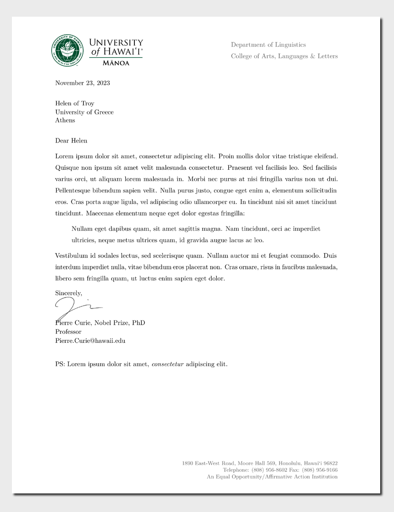

<!-- README.md is generated from README.qmd. Please edit that file -->

# University of Hawai‘i at Mānoa Letter Format Template

This Quarto template is a University of Hawai‘i at Mānoa letterhead for
members of the Department of Linguistics in the the College of Arts,
Languages & Letters. It can fairly easily be adapted. This template was
created by cloning and adapting the [Monash Letter Format
Template](https://github.com/numbats/monash-quarto-letter).

## Creating a new letter

To create a letter, run the following command:

``` bash
quarto use template mcdonn/uhm-quarto-letter
```

This command installs the extension and creates an example `.qmd` file
to use a template for the letter.

## Installation for existing document

This template can also be employed with an existing Quarto project or
document. From the Quarto project or document directory, run the
following command:

``` bash
quarto install extension mcdonn/uhm-quarto-letter
```

## Example

<div>

[](examples/template.pdf)

</div>
